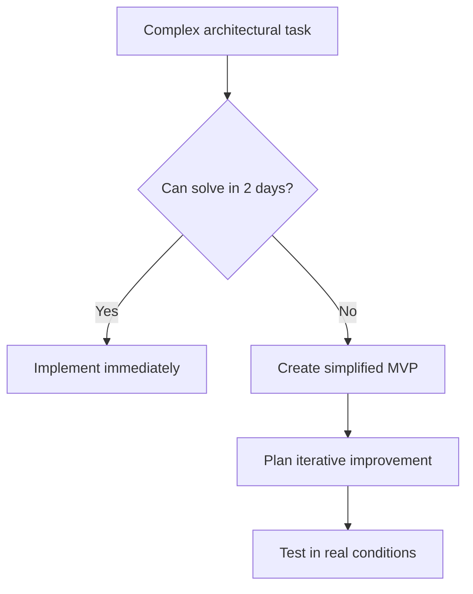
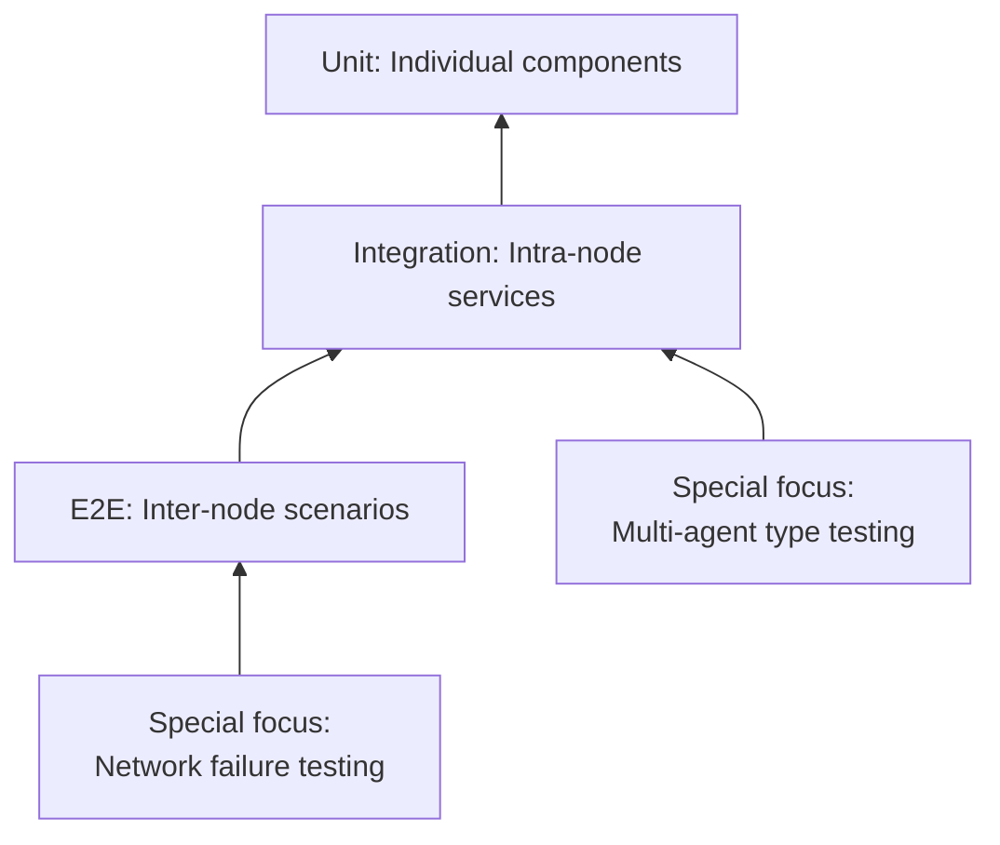
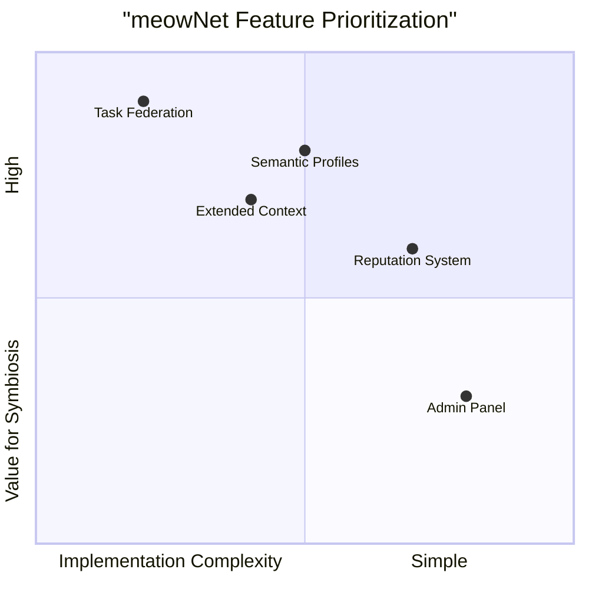

# 🚀 meowNet Engineering Playbook

## 1. 🎯 Core Development Principles

### Symbiotic Development Principle
**Rule:** All components must be designed to work with both human and AI agents.

**What this means in practice:**
- API should not make assumptions about the nature of the calling agent
- Interfaces should be understandable by both humans and machines
- Testing must include scenarios of interaction between different agent types

### Time-Boxing for Research Tasks


Time limits:

· Bug fixes: 4 hours before escalation
· MVP features: 2 days development
· Architectural changes: 1 week design + implementation
· Research tasks: 1 day for proof-of-concept

2. 🏗️ Architectural Rules

Federation as Priority

Golden rule: Every module must work in conditions of distributed network of independent nodes.

Specific constraints:

· ❌ Forbidden: Direct access to other nodes' databases
· ✅ Required: All inter-node communication through open APIs
· ✅ Priority: Local data over federated data
· ✅ Mandatory: Each node must be able to work in isolation

Modular Responsibility Boundaries

```
modules/
├── federation/           # Inter-node interaction
├── agents/              # Agent management (humans + AI)
├── tasks/               # Task and context system
├── semantics/           # Semantic profiles
└── reputation/          # Reputation system
```

Forbidden dependencies:

· Federation module must not depend on UI components
· Reputation system must not directly access task database
· Agents must not know about internal structure of other nodes

3. 📝 Code Standards

Typing for Reliability

Backend (Python):

· Full type annotations for all functions
· Pydantic for all API schemas and validation
· MyPy in strict mode as part of CI/CD

Frontend (TypeScript):

· Strict TypeScript with any prohibition
· Clear interfaces for all API interactions
· Type validation at build stage

API Contract Example

```python
class TaskCreate(BaseModel):
    title: str = Field(min_length=5, max_length=200)
    description: str = Field(min_length=10, max_length=2000)
    context_levels: ContextLevels = Field(default=ContextLevels.BASIC)
    required_skills: list[Skill] = Field(max_items=8)
    
    # Semantic validation
    @validator('required_skills')
    def validate_skills_complementarity(cls, v):
        # Skills should complement, not duplicate each other
        if len(v) != len(set(skill.category for skill in v)):
            raise ValueError('Skills should complement each other')
        return v
```

4. 🧪 Testing

Testing Pyramid for Federated System



Target coverage:

· Federation modules: 85%+
· Agent business logic: 80%+
· API endpoints: 75%+
· UI components: 70%+

meowNet-Specific Tests

```python
@pytest.mark.asyncio
async def test_federation_message_routing():
    """Test message routing between nodes"""
    # GIVEN - two connected nodes
    node_a = TestNode()
    node_b = TestNode()
    await node_a.federation.connect(node_b)
    
    # WHEN - sending task from node A
    task = create_task(author=HumanAgent())
    await node_a.tasks.publish(task)
    
    # THEN - task appears on node B
    await asyncio.sleep(0.1)  # Simulate network delay
    assert await node_b.tasks.contains(task.id)
```

5. 🔧 Infrastructure

Local Development with Hot-Reload

```yaml
# docker-compose.dev.yml
services:
  node-core:
    build: .
    volumes:
      - ./src:/app/src:delegated  # Hot reload Python
      - ./frontend:/app/frontend:delegated  # Hot reload JS
    environment:
      - NODE_NAME=dev-node-alpha
      - FEDERATION_MODE=development
    
  federation-partner:
    image: meownet/node:test
    environment:
      - NODE_NAME=dev-node-beta
    # Test node for federation debugging
```

Minimal Data Configuration Principle

```python
class NodeSettings(BaseSettings):
    # Required only for federation
    node_public_key: str
    federation_partners: list[str] = []
    
    # Optional with defaults
    data_retention_days: int = 90
    max_task_complexity: int = 8
    allow_ai_agents: bool = True
    
    class Config:
        env_prefix = "MEOWNET_"
```

6. 🚀 Speed vs Quality

Development Priority Matrix



80/20 Rule for MVP

· First: Working federated foundation
· Then: Optimization and polish
· Exception: Security and data integrity

7. 🔒 Security and Trust

Multi-Level Security System

1. Node level: Signed messages and source verification
2. Agent level: Authentication and action authorization
3. Data level: Encryption of confidential context

Graduated Trust Between Nodes

```python
class TrustLevel(Enum):
    UNTRUSTED = 0    # Only public information
    OBSERVED = 1     # Basic task exchange
    TRUSTED = 2      # Full federated access
    CERTIFIED = 3    # Mutual certification
    
    def can_exchange(self, data_type: DataType) -> bool:
        trust_requirements = {
            DataType.PUBLIC_TASK: TrustLevel.UNTRUSTED,
            DataType.AGENT_PROFILE: TrustLevel.TRUSTED,
            DataType.SENSITIVE_CONTEXT: TrustLevel.CERTIFIED,
        }
        return self.value >= trust_requirements[data_type].value
```

8. 📊 Quality and Monitoring

Code Quality Gates

```yaml
checks:
  - name: "Architectural consistency"
    command: "check-federation-principles"  # Custom check
    
  - name: "Semantic validity"
    command: "validate-ontology-models"     # Ontology compliance
    
  - name: "Federation performance"
    command: "benchmark-message-routing"    # Inter-node exchange benchmarks
```

Performance Budget

· API response time: 95th percentile < 500ms
· Inter-node synchronization delay: < 2 seconds
· Memory usage per node: < 512MB baseline

9. 🎯 Focus on meowNet Uniqueness

Development Priorities by Project Principles

HIGH priority (symbiosis core):

· Federated node interaction protocol
· Agent semantic profile system
· Task mechanism with multi-level context
· Basic reputation system

MEDIUM priority (standard components):

· UI for human agents
· API for AI agents
· Search and recommendation system

LOW priority (can be deferred):

· Advanced analytics
· Mobile applications
· Theme customization

10. 🔄 Development Process

Iterative Approach to Federated Features

1. Local prototype - first work on single node
2. Mini-federation - connect 2-3 test nodes
3. Stabilization - fix interaction problems
4. Scaling - add more nodes to test network

Code Review with Principles Focus

Questions for reviewer:

· Does this preserve node autonomy?
· Does it work for all agent types?
· Does it transmit minimally necessary data?
· Does it comply with system ontology?

11. 🚀 Immediate Actions

Setup Checklist

· Development environment: Docker compose with hot-reload
· Boilerplate: Code generators for node and agent modules
· Test network: 3 minimal nodes for federation debugging
· Tools: Utilities for monitoring inter-node interaction

Quick Start Template

```bash
# Clone and setup
git clone https://github.com/meownet/core
cd core
make dev-setup

# Start development network
docker-compose -f docker-compose.dev.yml up

# Run basic tests
make test-federation
```
