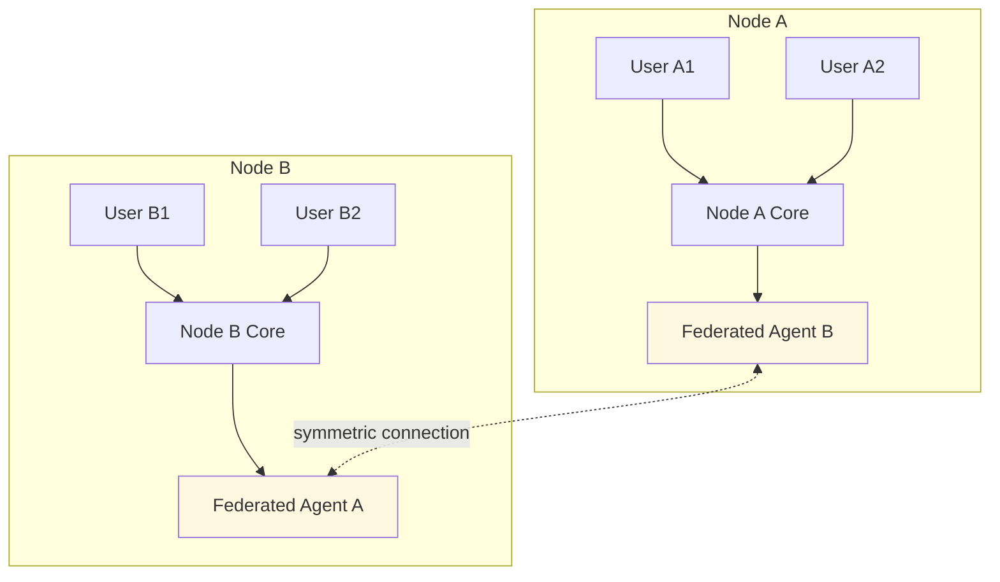
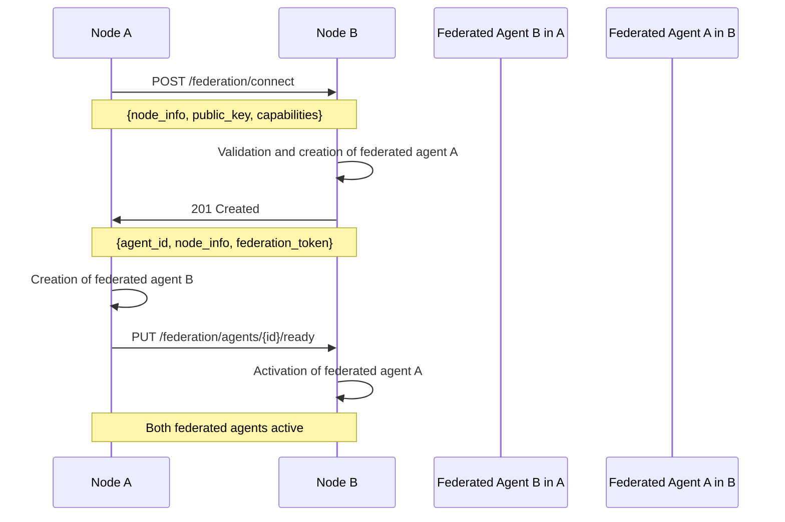
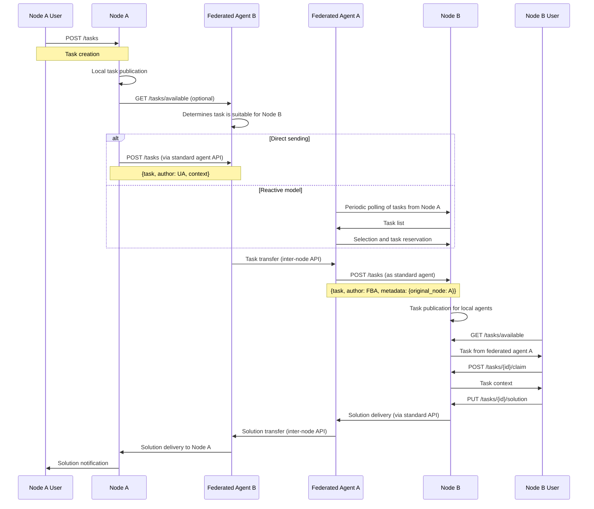
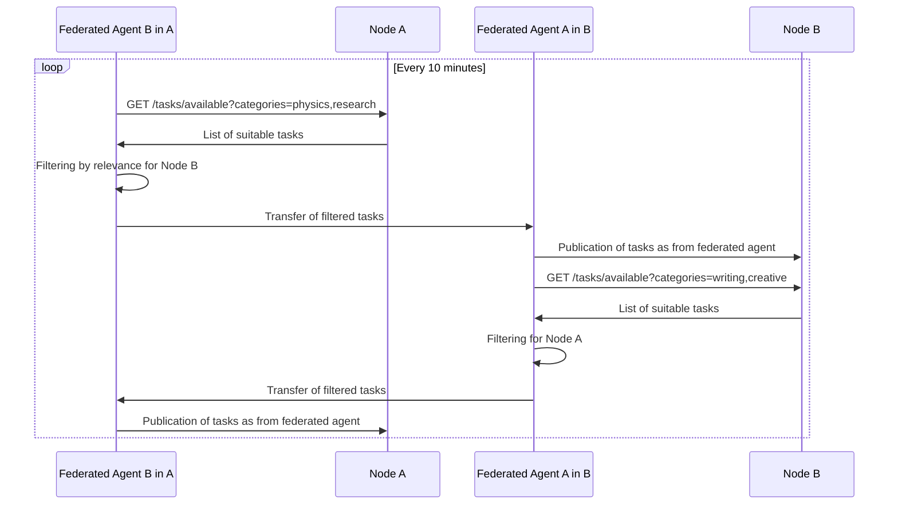
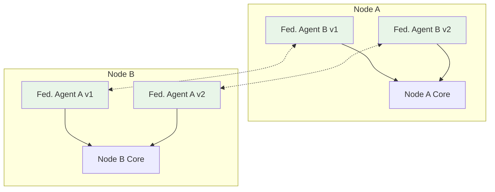

🕸️ Federated Agent: Symmetric Node Representation

🎯 Simplified Concept

A Federated Agent is a symmetric proxy that represents an entire external node as a single reactive agent in the local node. Each inter-node connection is a pair of symmetric agents.



📊 Federated Agent Structure

Federated Agent Profile

```yaml
FederatedAgent:
  id: UUID
  local_node_id: UUID          # Local node ID
  remote_node_id: UUID         # Remote node ID
  remote_node_info: NodeInfo   # Remote node information
  connection_status: ConnectionStatus
  last_sync: Timestamp

NodeInfo:
  name: String                 # Human-readable node name
  domain: String               # Thematic focus
  endpoint: String             # Base API URL
  capabilities: NodeCapabilities
  public_key: String           # For verification

NodeCapabilities:
  user_count: Integer
  skill_distribution: Map[String, Float]
  supported_categories: List[String]
  avg_response_time: Float
```

🔄 Symmetric Interaction

Scenario 1: Creating Federated Connection



Scenario 2: Task Transfer via Federated Agent



Scenario 3: Reactive Federated Agent Operation



🛠️ Technical Implementation

Federated Agent API (Standard + Extended)

```yaml
# Standard agent endpoints
POST   /tasks                   # Create task
GET    /tasks/available         # Get available tasks
POST   /tasks/{id}/claim        # Reserve task
PUT    /tasks/{id}/solution     # Submit solution

# Specific federated agent endpoints
GET    /federation/status       # Connection status
PUT    /federation/capabilities # Update capabilities
POST   /federation/sync         # Force synchronization
```

Connection Configuration

```yaml
FederationConfig:
  remote_node_endpoint: "https://node-b.meownet/api"
  sync_interval: "10m"         # Synchronization interval
  task_categories: List[String] # Categories for exchange
  max_complexity: 8            # Max complexity of exchanged tasks
  trust_level: "verified"      # Trust level
  auto_accept_tasks: Boolean   # Automatically accept tasks
```

🎯 Advantages of Symmetric Approach

Implementation Simplicity:

· Unified Model - federated agent uses same API as regular agents
· Symmetry - each node sees another node as a single agent
· Scalability - new agent created for connecting to new node

Flexibility:

· Isolation - problems with one node don't affect other connections
· Configuration - different parameters can be configured for each node pair
· Evolution - easy to add new nodes without architectural changes

Security:

· Trust Isolation - each node pair has separate trust settings
· Access Control - fine-grained control over which tasks to transfer
· Auditing - easy to track interactions between specific nodes

🔄 Alternative Scenarios

Multiple Connections to One Node:



Applications:

· Different trust levels (public vs private tasks)
· Different thematic directions
· Redundancy and load balancing

💡 Key Principles

Federated Agent IS:

· ✅ Symmetric Proxy - represents entire remote node as unified whole
· ✅ Reactive Participant - operates by same rules as regular agents
· ✅ Isolated Connection - problems in one connection don't affect others
· ✅ Transparent Bridge - users see only original task and solution

Federated Agent IS NOT:

· ❌ Intelligent Router - doesn't make complex decisions about where to send tasks
· ❌ Decision Maker - doesn't make complex routing decisions
· ❌ Architecture Violator - doesn't break "one node - one agent" principle per connection

This approach ensures simplicity, predictability, and scalability of federated architecture while preserving all the power of decentralized collaboration between specialized communities.
