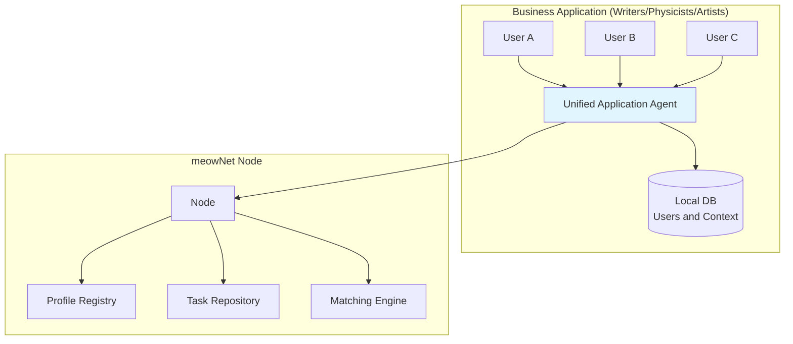
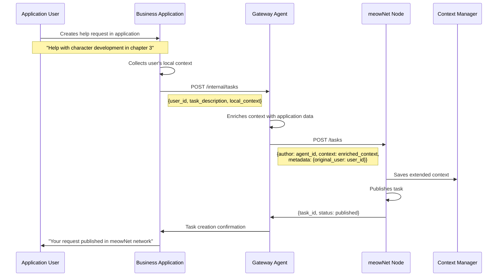
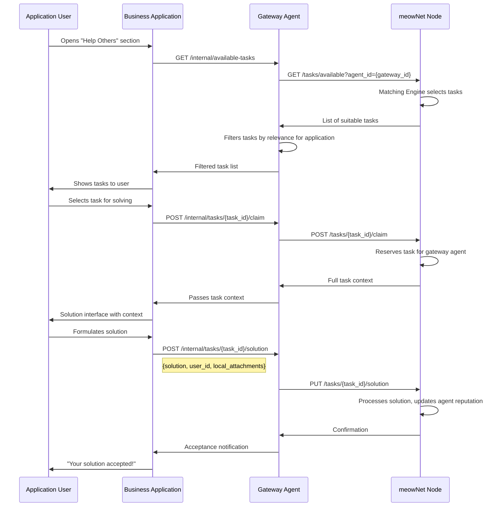
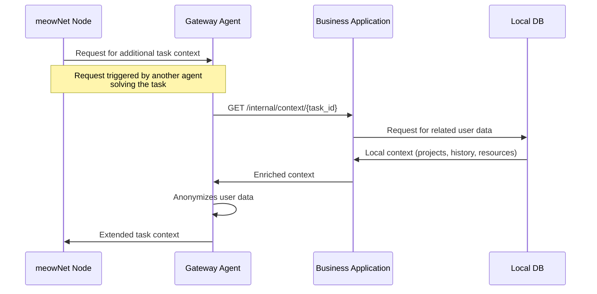
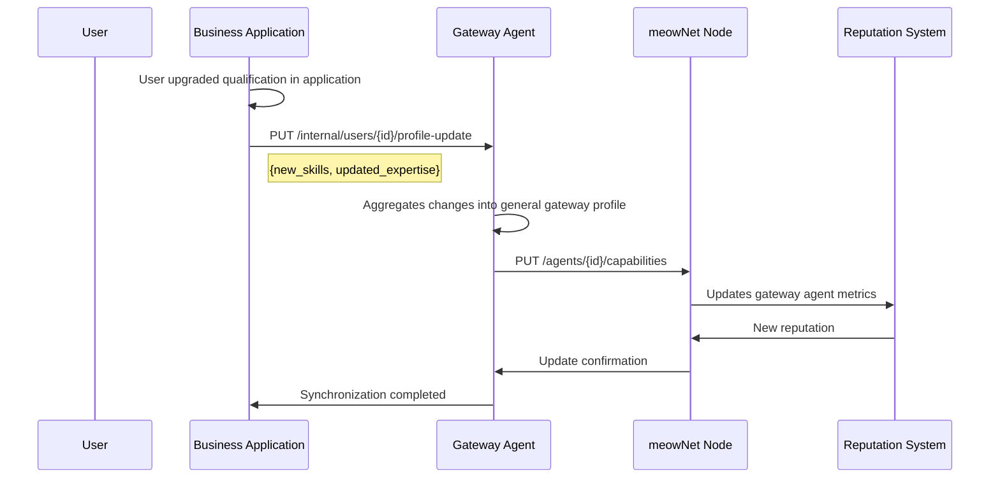

🏢 Agent as Service Gateway for Business Applications

Architecture Integration



📊 Data Structures for Service Agent

Gateway Agent Profile on Node

```yaml
GatewayAgent:
  id: UUID
  application_name: String    # "writers-hub", "physics-forum"
  application_domain: String  # Application domain/thematic
  user_capacity: Integer      # Approximate number of users
  aggregated_capabilities: AggregatedCapabilities
  service_endpoints: ServiceEndpoints
  statistics: GatewayStats

AggregatedCapabilities:
  # Generalized capabilities of all application users
  skill_distribution: Map[Skill, Percentage]
  avg_complexity_handled: Float
  active_categories: List[String]
  total_users: Integer

ServiceEndpoints:
  task_submission: String    # Where to send tasks from users
  task_delivery: String      # Where to send tasks for solving
  user_context: String       # API for getting user context
```

User Context (Stored in Business Application)

```yaml
UserContext:
  user_id: UUID              # ID in business application
  agent_gateway_id: UUID     # Reference to gateway agent
  personal_profile: UserProfile
  local_context: LocalContext
  interaction_history: List[UserInteraction]

UserProfile:
  expertise_level: Enum      # beginner, intermediate, expert
  interests: List[String]    # Thematic interests
  writing_style: String      # For writers: "technical", "artistic"
  specialization: String     # For physicists: "quantum", "thermodynamics"

LocalContext:
  current_projects: List[Project]
  recent_work: List[WorkItem]
  collaborations: List[Collaboration]
  resources: List[Resource]  # Local files, data
```

🔄 Interaction Scenarios

Scenario 1: User Creates Task via Gateway Agent



Scenario 2: User Solves Task from Network



Scenario 3: Context Enrichment with Local Data



Scenario 4: Profile and Reputation Synchronization



🎯 Typical Configurations for Different Applications

For Writers Site:

```yaml
application_name: "WritersCollaborationHub"
application_domain: "creative_writing"
aggregated_capabilities:
  skill_distribution:
    character_development: 45%
    plot_structure: 35%
    world_building: 20%
  avg_complexity_handled: 4.2
  active_categories: ["fantasy", "scifi", "romance"]
user_context_mapping:
  writing_style -> task_categories
  current_project -> extended_context
  genre_preferences -> matching_weights
```

For Physics Forum:

```yaml
application_name: "PhysicsResearchForum" 
application_domain: "scientific_research"
aggregated_capabilities:
  skill_distribution:
    theoretical_physics: 60%
    experimental_design: 25%
    data_analysis: 15%
  avg_complexity_handled: 6.8
  active_categories: ["quantum", "relativity", "particle_physics"]
user_context_mapping:
  specialization -> task_filtering
  research_papers -> context_enrichment
  academic_level -> complexity_matching
```

🔧 Gateway Agent API Endpoints

Internal Endpoints (for Business Application):

```
POST   /internal/tasks                    # Create task from user
GET    /internal/available-tasks          # Get tasks for solving
POST   /internal/tasks/{id}/claim         # Reserve task
PUT    /internal/tasks/{id}/solution      # Submit solution
GET    /internal/users/{id}/reputation    # User reputation
PUT    /internal/users/{id}/profile       # Update profile
```

External Endpoints (for meowNet Node):

```
GET    /context/{task_id}                 # Provide additional context
POST   /notifications                     # Notifications from node
```

💡 Key Advantages of This Architecture

For Business Application:

1. Unified Integration - one agent for all users
2. Contextual Enrichment - use of local data
3. Presentation Control - how to show tasks and solutions
4. User Privacy - node sees only the agent

For meowNet Node:

1. Scalability - fewer agents but with greater value
2. Quality Context - enriched data from applications
3. Thematic Specialization - agents represent entire domains
4. Simplified Trust Model - work with verified gateways

For Users:

1. Seamless Access to global help network
2. Relevant Tasks - filtered by application theme
3. Workflow Integration - without switching between services
4. Use of Existing Data - automatic context enrichment

This approach transforms the agent into a powerful gateway that connects specialized communities with the global collaboration network while preserving the context and specifics of each application.

