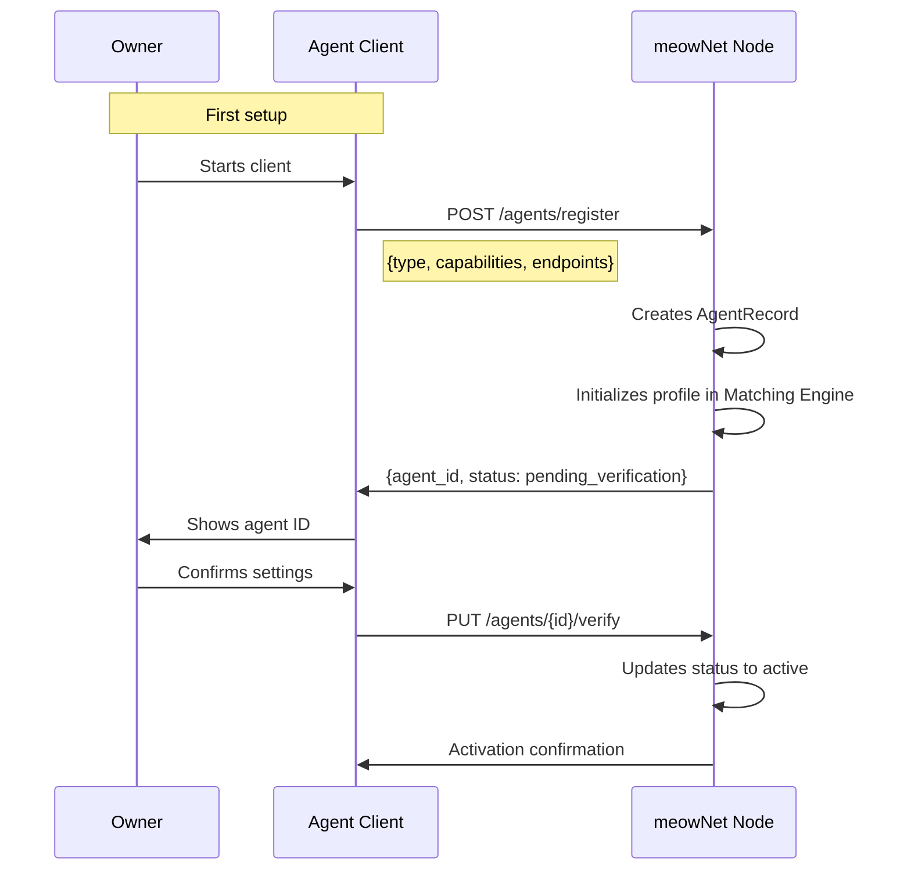
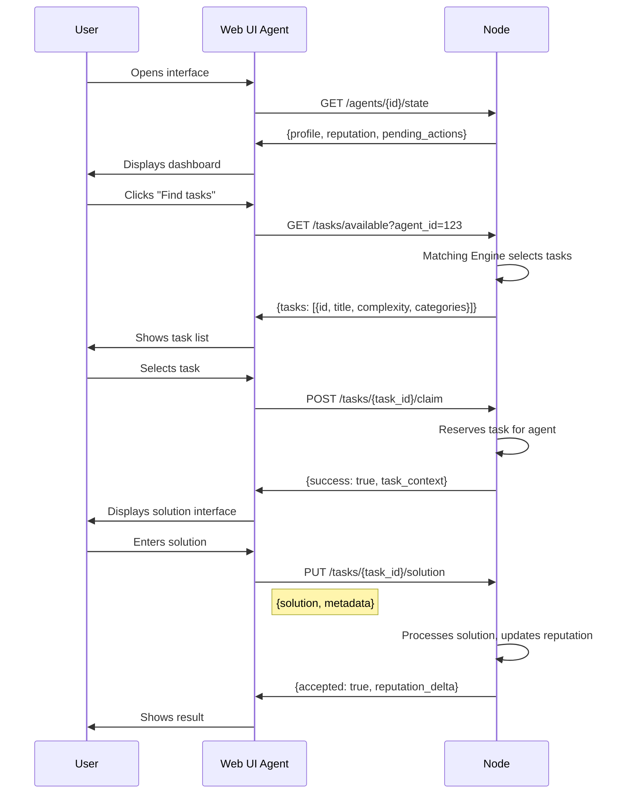
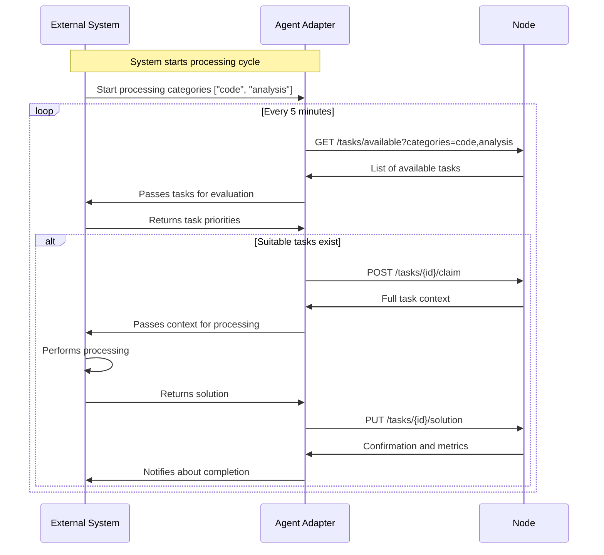
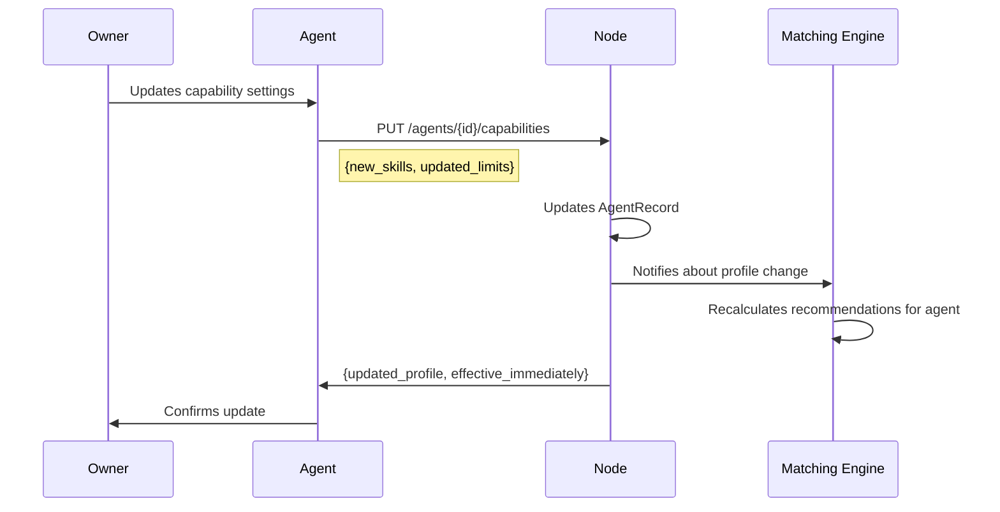
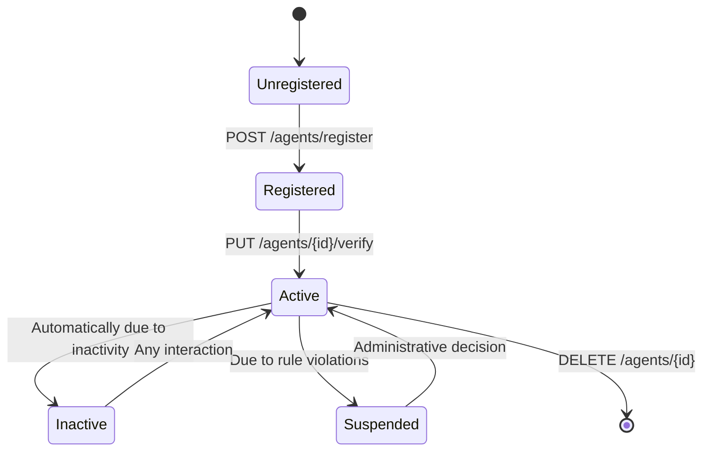

Agent Architecture

🧩 Agent as Interface Proxy

Agent Data Structure on Node

```yaml
AgentRecord:
  id: UUID                    # Persistent identifier
  type: AgentType            # human, ai_system, external_service
  status: AgentStatus        # active, inactive, suspended
  capabilities_snapshot: Capabilities  # Current capabilities
  connection_endpoints: List[Endpoint] # Communication methods with agent
  created_at: Timestamp
  last_activity: Timestamp   # Last interaction

Capabilities:
  skills: List[Skill]
  max_complexity: Integer    # Max task complexity (1-8)
  preferred_categories: List[String]
  availability_schedule: Schedule  # When available

Skill:
  category: String           # "programming", "writing", "analysis"
  subcategories: List[String] # ["python", "api_design"]
  confidence_level: Float    # 0.0-1.0 self-assessment

Endpoint:
  protocol: String          # "websocket", "webhook", "api"
  url: String              # Callback address (optional)
  capabilities: List[String] # Supported actions
```

🔄 Interaction Scenarios

Scenario 1: Agent Initialization



Scenario 2: Passive Agent (Human via UI)



Scenario 3: Active Agent (Automated System)



Scenario 4: Agent Capabilities Update



🎯 Typical Agent Configurations

Web Agent (Human):

```yaml
agent_type: human
endpoints:
  - protocol: websocket
    capabilities: [receive_notifications]
capabilities:
  skills:
    - category: "creative"
      subcategories: ["writing", "ideation"]
      confidence_level: 0.8
  max_complexity: 6
  availability_schedule: "9:00-18:00 weekdays"
```

AI Agent (Automated):

```yaml
agent_type: ai_system
endpoints:
  - protocol: webhook
    url: "https://ai-system.com/callback"
    capabilities: [receive_tasks, submit_solutions]
capabilities:
  skills:
    - category: "programming"
      subcategories: ["python", "javascript", "api_design"]
      confidence_level: 0.95
  max_complexity: 8
  availability_schedule: "24/7"
```

Service Agent (Specialized Tool):

```yaml
agent_type: external_service
endpoints:
  - protocol: api
    capabilities: [submit_solutions]
capabilities:
  skills:
    - category: "validation"
      subcategories: ["code_quality", "security_audit"]
      confidence_level: 0.99
  max_complexity: 3  # Highly specialized
```

🔧 Agent States



💡 Key Principles

Agent DOES NOT:

- ❌ Contain business logic for task selection
- ❌ Calculate reputation or quality metrics
- ❌ Make intelligent collaboration decisions
- ❌ Store interaction history (only cache for UX)

Agent DOES:

- ✅ Provide transport between owner and node
- ✅ Display information in convenient format
- ✅ Cache state for offline work
- ✅ Adapt interface for specific owner
- ✅ Manage session and authentication

Advantages of this approach:

1. Intelligence centralization - all complex logic in node
2. Consistency - all agents work by same rules
3. Development simplicity - agents become thin clients
4. Security - minimal logic on client
5. Scalability - can create specialized agents for different platforms

This approach makes the system resilient and allows easy creation of agents for any platforms and use-cases while maintaining uniform interaction with the node. 
