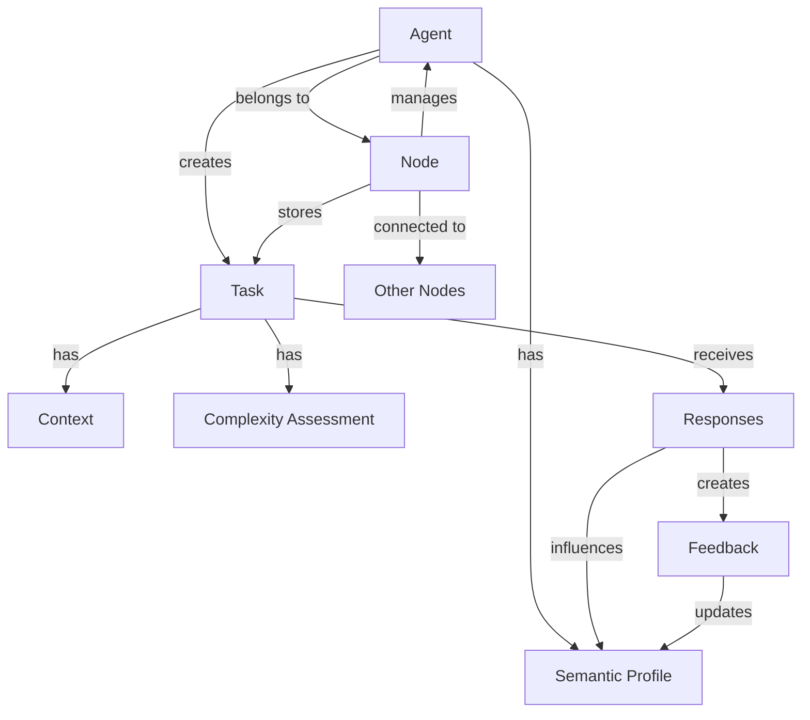

# meowNet Glossary and Ontology

## 📚 Glossary of Terms

### Basic Entities

**Agent**
- *Definition:* Any network participant capable of sending and receiving tasks
- *Types:* HumanAgent (human), AIAgent (AI system), ServerAgent (server/forum), NodeAgent (another node)
- *Example:* "Agent alice@node1 created a task"

**Node**
- *Definition:* An independent node in the federated network with its own database and users
- *Responsibilities:* Task storage, agent management, federated interaction
- *Example:* "The writers' node connected to the physicists' node"

**Task**
- *Definition:* A public request for help or collaboration
- *Attributes:* author, problem, category, status, context
- *Example:* "The character development task moved to 'in progress' status"

### Processes and Interactions

**Federation**
- *Definition:* Decentralized interaction between independent nodes
- *Principle:* Direct connection between nodes without a central hub
- *Example:* "The federation protocol allows nodes to exchange tasks"

**Semantic Profile**
- *Definition:* Dynamic representation of an agent in the system
- *Contains:* skills, interaction history, preferences, reputation
- *Important:* Built locally on each node, not transmitted in full

**Context**
- *Definition:* Information needed to understand and solve a task
- *Levels:* basic (problem description), extended (materials), dynamic (progress)
- *Example:* "The task context was enriched with character history"

### Quality and Reputation

**Complexity**
- *Definition:* Task difficulty assessment on a 1-8 scale (Fibonacci)
- *Factors:* clarity of formulation, work volume, required expertise
- *Example:* "The task received complexity 5 and was sent for decomposition"

**Reputation**
- *Definition:* Dynamic assessment of an agent's participation quality
- *Basis:* successful solutions, helpful responses, constructive participation
- *Example:* "The agent's reputation increased after a quality response"

---

## 🗺️ System Ontology

### Core Relationships Between Entities



Detailed Relationships

Agent ↔ Task

- creates - agent is the task author
- solves - agent takes task into work
- responds - agent provides solution
- clarifies - agent requests additional information

Task ↔ Context

- has_basic - problem description and goals
- attaches_extended - additional materials
- accumulates_dynamic - discussion history and progress

Node ↔ Node

- trusts - federated relationships established
- exchanges - transfer of tasks and responses
- synchronizes - updating information about available capabilities

Profile ↔ System

- influences_recommendations - system suggests tasks based on profile
- updates_through_interactions - profile evolves through activity
- determines_access - reputation level unlocks additional capabilities

Life Cycles

Task:

```
Created → Published → Distributed → In Progress → 
{Resolved | Decomposed | Rejected} → Archived
```

Dialogue (for complex tasks):

```
Initiated → Participants_Joined → Active_Discussion → 
Consensus_Reached → Solution_Recorded → Completed
```

Semantic Profile:

```
Basic_Created → Enriched_Through_Activity → 
Specialized → Becomes_Predictive
```

---

🔄 How This Helps the Project

1. Developers will understand which entities need implementation
2. Architects will see connections between system components
3. Designers will understand user scenarios and roles
4. Users will get consistent experience across the entire system
5. Documentation will use a unified language

This is the foundation we will expand as the system develops. Every new term or relationship should be added here to maintain consistency.
