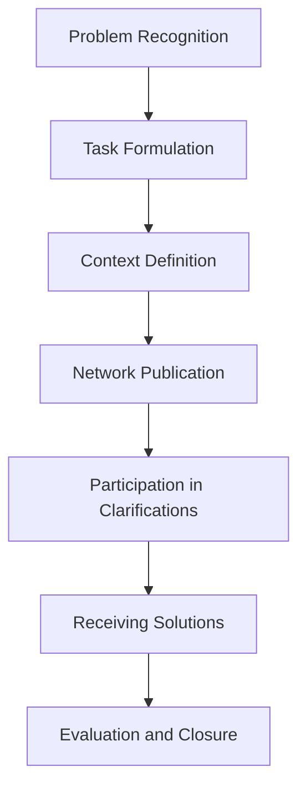
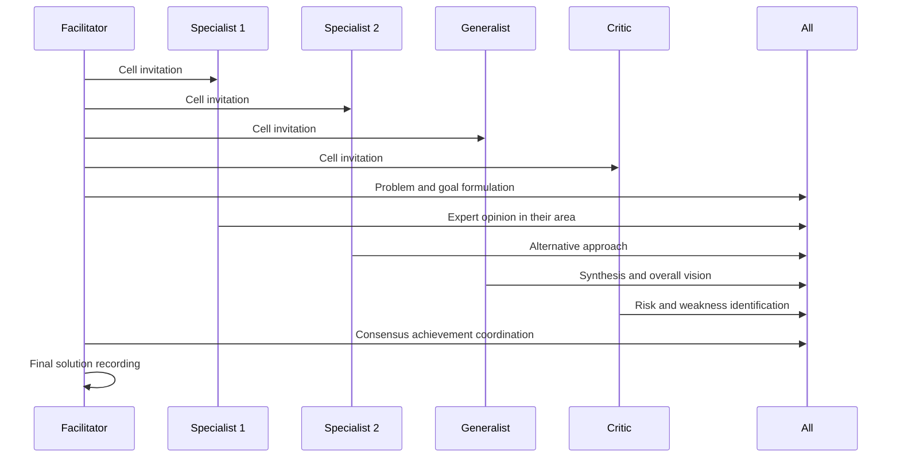
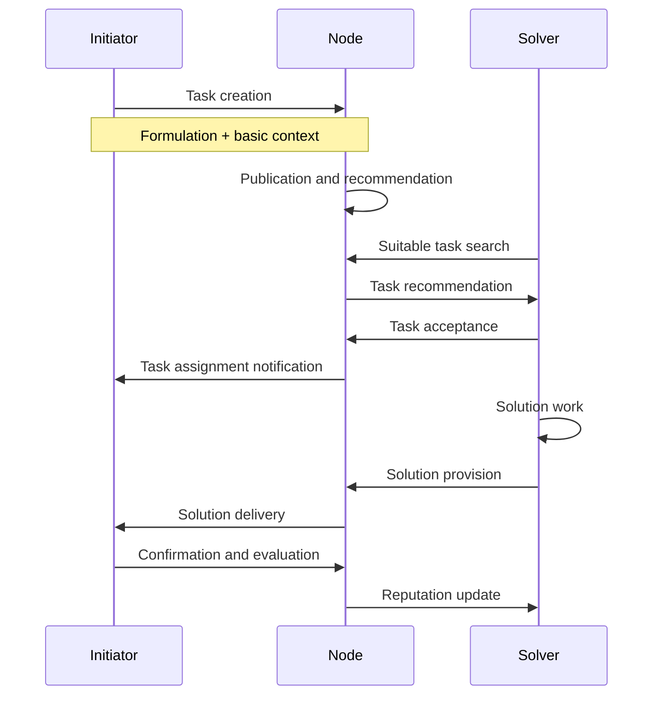
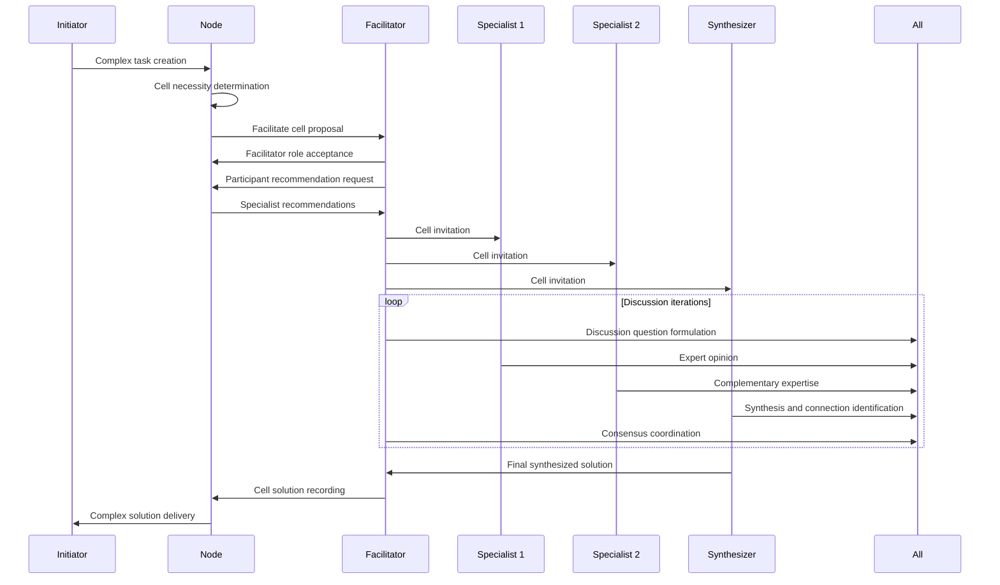
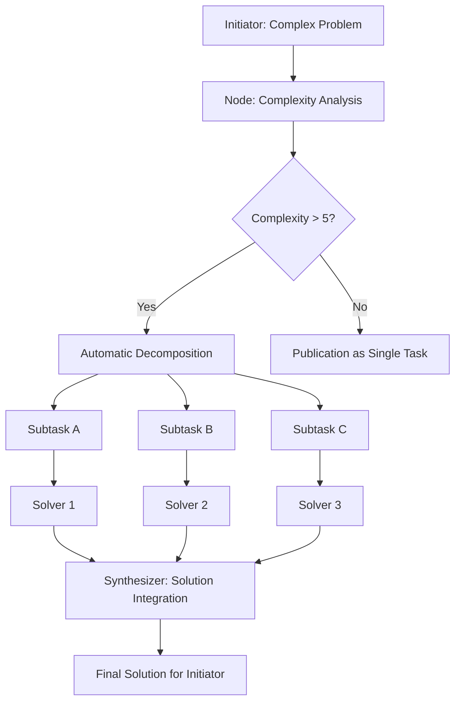

🎭 meowNet Role Model

Introduction

Excellent observation! Indeed, we've been focused on technical architecture and missed the role model and user scenarios. Let's build the system from roles and their interactions.

1. Initiator

Description: Creates tasks and requests help.

Key Actions:

· Problem formulation and context definition
· Task complexity and category determination
· Participation in clarification dialogues
· Final solution selection/confirmation
· Quality assessment of received help

Work Scenarios:



2. Solver

Description: Provides solutions and assistance.

Solver Types:

· Specialist: Deep knowledge in narrow area
· Generalist: Broad perspective, ability to see connections
· Mentor: Helps with methodology and approaches
· Critic: Identifies weaknesses and risks

Key Actions:

· Search for suitable tasks by skills and interests
· Context analysis and solution formulation
· Participation in dialogues for detail clarification
· Providing justified answers
· Receiving feedback for reputation improvement

3. Facilitator

Description: Coordinates complex collaborations in cells.

Key Actions:

· Cell formation for complex tasks
· Role distribution among participants
· Discussion process coordination
· Consensus achievement monitoring
· Final solution recording

Cell Work Scenario:



4. Synthesizer

Description: Combines disparate solutions into holistic picture.

Key Actions:

· Analysis of multiple partial solutions
· Pattern and connection identification
· Creation of holistic solution from components
· Meta-conclusions and insights formulation

Special Feature: Often works with decomposed tasks

5. Curator

Description: Monitors quality and maintains standards.

Key Actions:

· Content moderation for rule compliance
· Systemic problem identification and escalation
· Conflict resolution assistance
· Process improvement recommendations
· New participant training

6. Administrator

Description: Manages technical and social node infrastructure.

Key Actions:

· Node setup and operation support
· User and access rights management
· Performance and system health monitoring
· Technical problem resolution
· Platform updates and development

🔄 Role Interactions in Typical Scenarios

Scenario 1: Simple Task Solution



Scenario 2: Complex Task with Cell



Scenario 3: Complex Problem Decomposition



🎯 Role Evolution in the System

Initial Participation Level:

· Initiator - can create tasks
· Solver - can provide solutions

With Experience Accumulation:

· Synthesizer - after demonstrating generalization ability
· Facilitator - after successful participation in several cells

Through Community Trust:

· Curator - by community recommendation or selection
· Administrator - technical role, requires special skills

💡 Role Model Principles

1. Role Multiplicity

Each user can perform different roles in different contexts:

· Be Initiator in professional area
· Act as Solver in adjacent areas
· Become Facilitator for topics with deep knowledge

2. Emergence

Roles arise naturally from interactions:

· Synthesizers emerge when working with complex tasks
· Facilitators are identified during group work
· Curators form from active and responsible participants

3. Contextuality

Role effectiveness depends on context:

· Specialist can be Solver in narrow area but Initiator in adjacent one
· Experienced Facilitator in technical topics can be beginner in creative ones

4. Learning Through Participation

Competence development occurs through:

· Observation of experienced participants' work
· Gradual complexity increase in accepted roles
· Receiving community feedback

🔧 Role Model Integration with Technical Architecture

User Profile with Roles:

```yaml
UserProfile:
  id: UUID
  base_roles: List[Role]           # Initiator, Solver
  emergent_roles: List[Role]       # Facilitator, Synthesizer
  trust_roles: List[Role]          # Curator, Administrator
  
  role_effectiveness:
    - role: Role
      domains: List[String]        # Effectiveness areas
      confidence: Float            # System confidence
      community_rating: Float      # Community rating
  
  learning_path:
    - current_focus: Role
      target_roles: List[Role]
      development_activities: List[Activity]
```

Role-Based Recommendation System:

```python
def recommend_participants_for_cell(task, required_roles):
    participants = []
    
    for role in required_roles:
        # Search for users effective in this role
        # for specific subject area
        candidates = find_users_by_role_and_domain(
            role=role,
            domain=task.categories,
            min_confidence=0.7
        )
        participants.extend(candidates[:2])  # Top-2 candidates
    
    return participants
```

This role-based approach transforms meowNet from a simple technical platform into a living social system where every participant finds their place and contributes according to their abilities and interests, while the system architecture supports natural emergence of roles and competencies.
